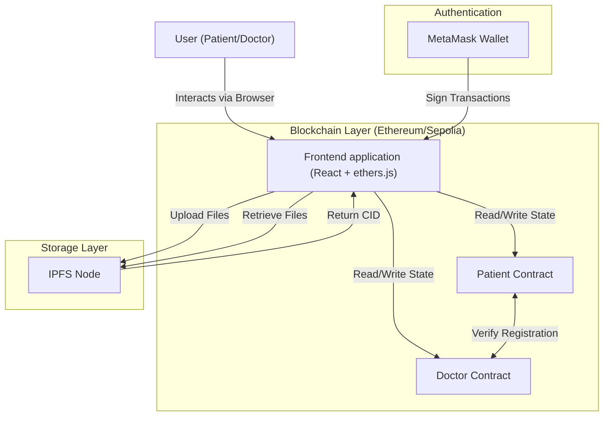
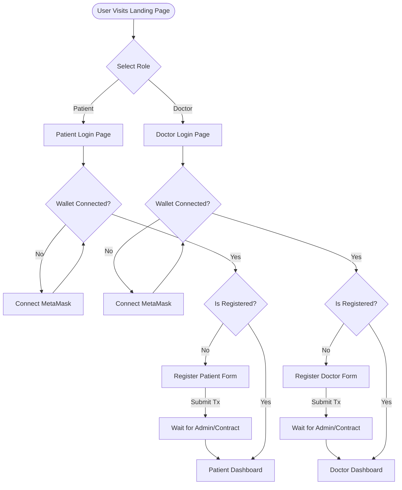
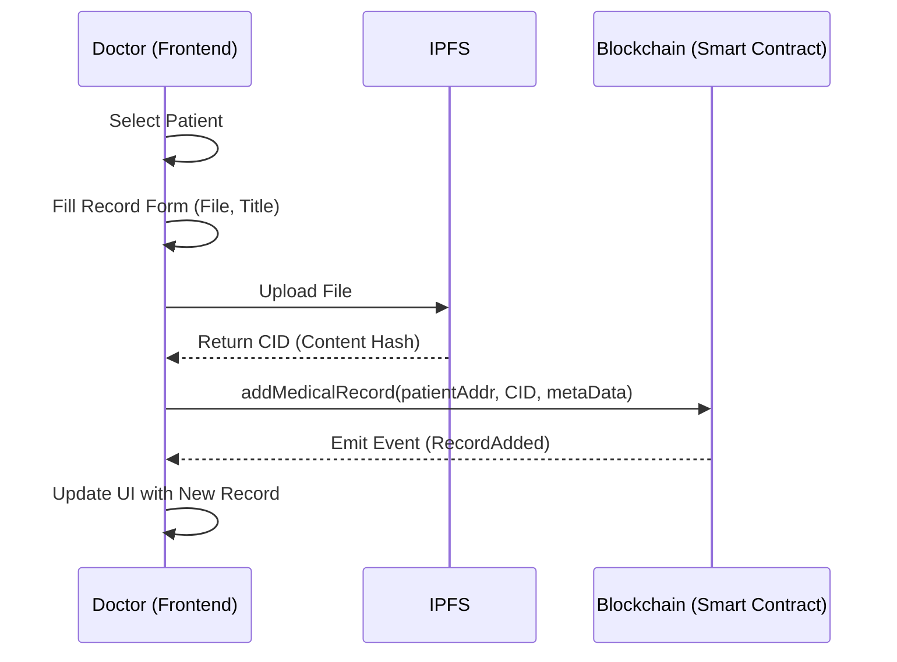
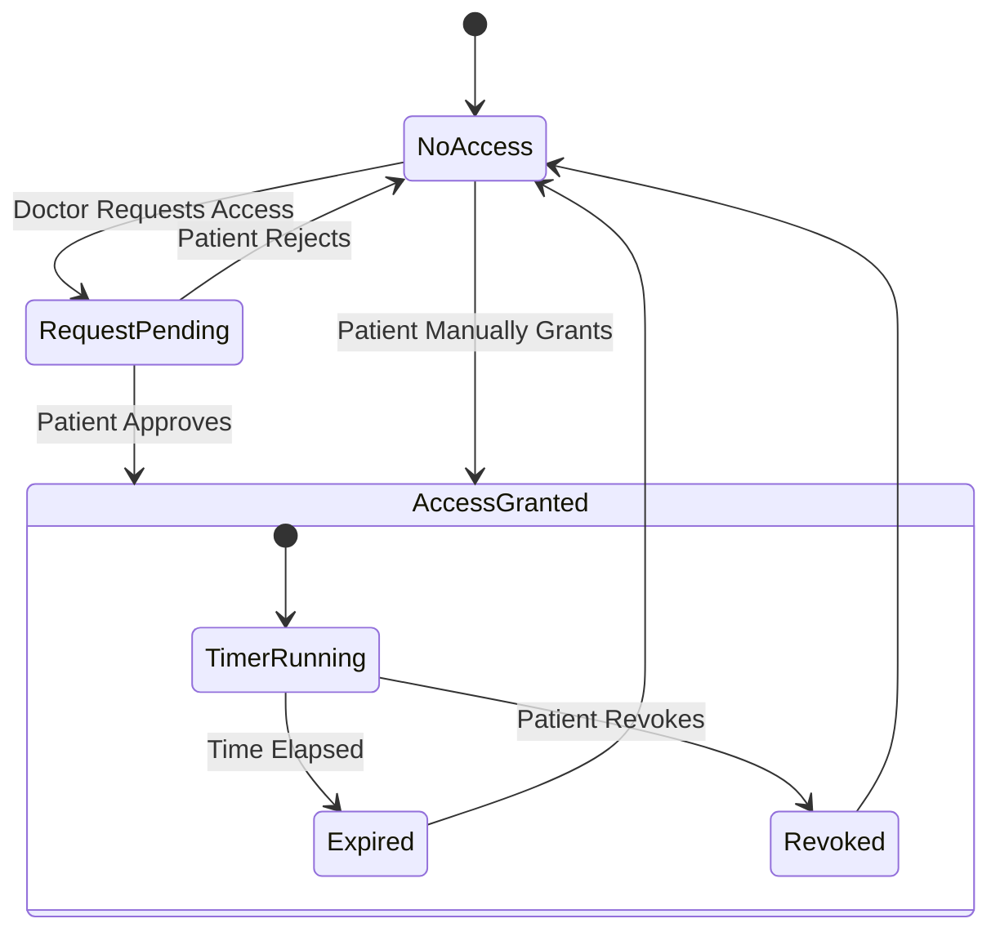
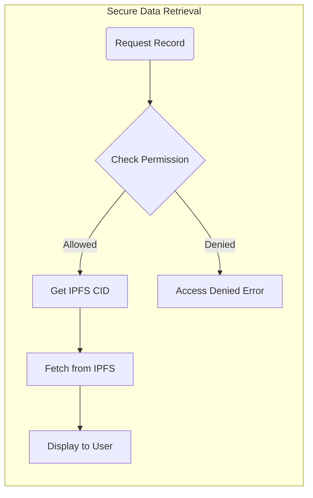

# Medical Block System Design

This document outlines the architecture, user flows, and data interaction models for the MedBloc.

## 1. System Architecture

The application follows a Decentralized Application (dApp) architecture, leveraging Ethereum for access control and IPFS for secure, distributed storage of medical records.

### Key Components
*   **Frontend (React)**: Handles user interface, wallet connection, and logic.
*   **Smart Contracts (Solidity)**:
    *   `PatientContract`: Manages patient registry, medical records (CIDs), and access control rules.
    *   `DoctorContract`: Manages doctor registry and authorized patient lists.
*   **IPFS (InterPlanetary File System)**: Stores the actual medical record files (PDFs, Images) ensuring decentralization.
*   **MetaMask**: Provides identity management and transaction signing.

---

## 2. User Flowcharts

### 2.1 Registration & Authentication
Users must register for a specific role (Patient or Doctor) before accessing features.

### 2.2 Medical Record Upload (Doctor)
Doctors upload records for authorized patients.

### 2.3 Access Control Flow
Patients control who can view their records via a time-limited grant system.

---

## 3. Data Flow & Security Model

### 3.1 Data Privacy Model
*   **Public Data**: Wallet addresses, Registration status.
*   **Protected Data**: IPFS CIDs (Links to files).
*   **Access Logic**:
    1.  User requests a file.
    2.  Smart Contract checks: `if (msg.sender == patient || allowed[patient][msg.sender] > now)`
    3.  If strict check passes, Frontend receives the IPFS CID.
    4.  Frontend fetches file from IPFS using CID.

## 4. Component Interaction Map

Map of React components to their primary responsibilities.

| Component | Responsibility |
| :--- | :--- |
| `App.js` | Routing, Wallet Connection, Contract Instantiation |
| `Navbar.js` | Global Navigation, Dynamic Login State |
| `LandingPage.js` | Role Selection, Product Features |
| `patientpage.js` | **Patient Dashboard**: View Records, Manage Access Requests |
| `doctorpage.js` | **Doctor Dashboard**: View Patients, Upload Records |
| `Research.js` | **Researcher Portal**: View specific patient records (Read-Only) |
| `adminpage.js` | **Admin Only**: Register new Patients/Doctors |
