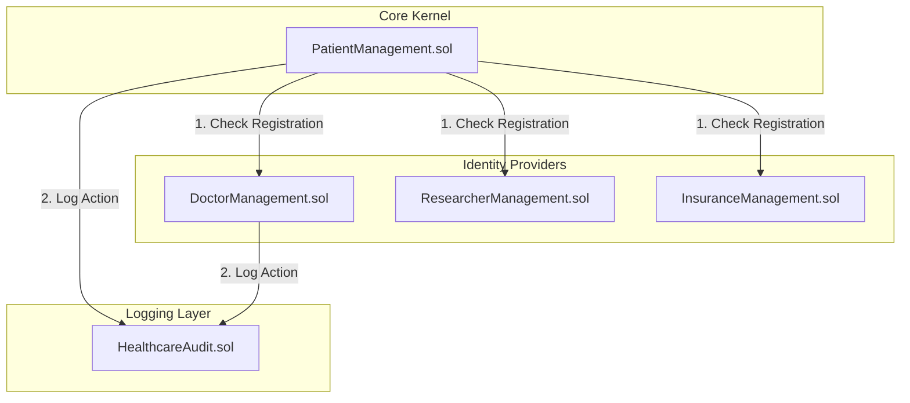
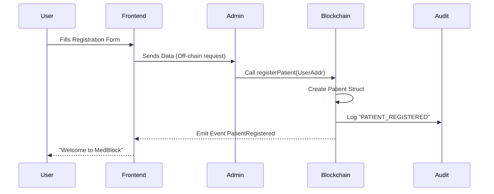
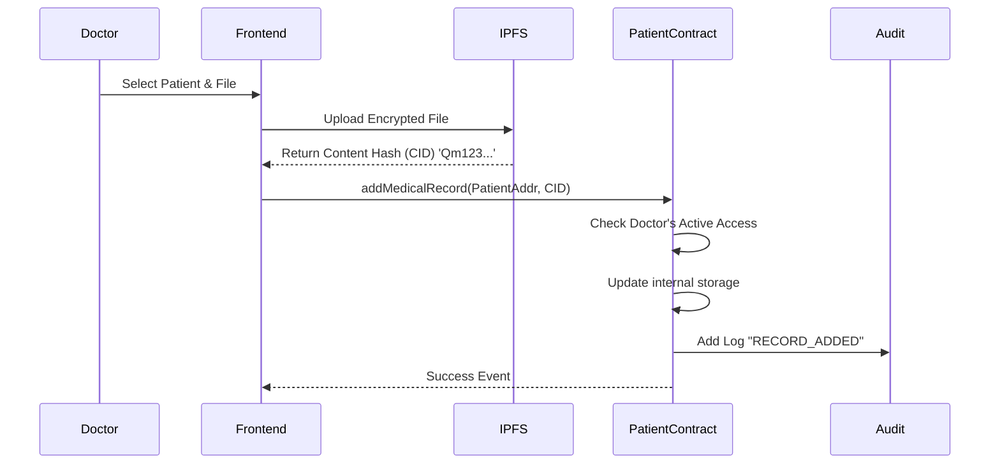
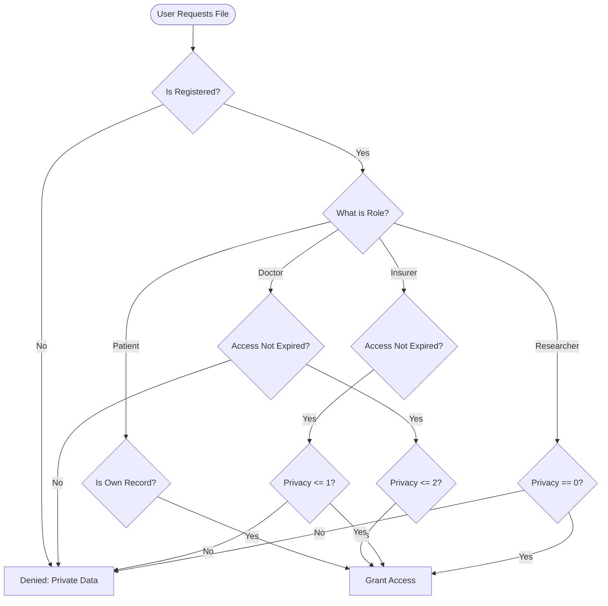

# MedBlock: The Ultimate System Design & Technical Reference

**Date:** January 24, 2026
**Status:** Production-Ready (Testnet)

---

## 1. Abstract

MedBlock is re-engineers the traditional healthcare data model by moving from **Institution-Centric** storage (where hospitals own data) to **Patient-Centric** ownership (where patients own data).

This is achieved through a **Hybrid Decentralized Architecture**:
1.  **Identity & Permissions**: Managed on-chain via **Ethereum Smart Contracts**.
2.  **Data Persistence**: Managed off-chain via **IPFS (InterPlanetary File System)**.

This document serves as the definitive technical guide to the entire MedBlock ecosystem, detailing every interaction, data structure, and security mechanism.

---

## 2. Architectural Philosophy

The system is built on the principe of **"Trust through Verification"**.

### 2.1 The "Data Silo" Problem
Current systems fragment patient history. A patient visiting five different specialists often leaves traces of their medical history in five disconnected databases.
*   **Consequence**: Incomplete diagnosis, redundant testing, and data leakage.

### 2.2 The MedBlock Solution
MedBlock acts as a **Universal Index**.
*   The *File* stays distributed (IPFS).
*   The *Index* stays global (Blockchain).
*   The *Key* stays with the Patient.

---

## 3. System Architecture: The "Five-Contract" Ecosystem

The backend logic is not monolithic. It is a cluster of specialized micro-contracts that interact via Interfaces.

### 3.1 PatientManagement.sol (The Kernel)
This contract is the **Single Source of Truth** for data ownership.
*   **State Variables**:
    *   `mapping(address => Patient)`: The registry.
    *   `mapping(address => MedicalRecord[])`: The actual data pointer.
    *   `mapping(address => mapping(address => uint256)) accessExpiry`: The permission matrix.
*   **Responsibilities**:
    *   Validating uploader permissions (`msg.sender` == Doctor).
    *   Validating viewer permissions (`block.timestamp` < expiry).
    *   Routing identity checks to external contracts.

### 3.2 DoctorManagement.sol (The Gatekeeper)
*   **Responsibilities**:
    *   Curates the list of valid Doctors.
    *   Maintains `authorizedPatients` mapping for Doctors (Quick-access list).
    *   **Security**: Only the `Admin` can verify/add new doctors, preventing Sybil attacks.

### 3.3 HealthcareAudit.sol (The Black Box)
*   **Responsibilities**:
    *   The "Flight Recorder" of the blockchain.
    *   Stores `struct AuditLog { address actor; string action; address target; ... }`.
    *   **Immutability**: Once written, logs cannot be deleted, providing a forensic trail for malpractice or data misuse.

---

## 4. Visual Workflows

### 4.1 Workflow: Patient Registration (The Onboarding)

Users cannot simply "exist"; they must be explicitly registered to prevent spam.

### 4.2 Workflow: The Secure Upload Lifecycle

How a static file becomes a secured blockchain asset.

### 4.3 Workflow: Granular Access Retrieval

The decision tree for "Can I see this file?".

---

## 5. Privacy Levels & Data Taxonomy

MedBlock recognizes that not all medical data is equal. A "Sick Leave Certificate" is different from "Psychotherapy Notes".

### Level 0: Public / Research
*   **Definition**: Data that is anonymized or low-risk.
*   **Examples**: Blood Type, Vaccination Status, Generic Allergies.
*   **Access**: Open to **Researchers**, **Insurers**, **Doctors**.

### Level 1: Standard / Administrative
*   **Definition**: General medical history required for claims and treatment.
*   **Examples**: X-Rays, Lab Reports, Prescriptions, Hospital Discharge Summaries.
*   **Access**: Open to **Insurers** (for claims) and **Doctors**. **Hidden from Researchers**.

### Level 2: Private / Confidential
*   **Definition**: Highly sensitive data protected by stricter privilege.
*   **Examples**: Mental Health records, Genetic testing, HIV/STD status.
*   **Access**: **Strictly Doctor-Patient Confidentiality**. Hidden from Insurers and Researchers.

---

## 6. Technical Deep Dive

### 6.1 Frontend State Management
The React application uses a **Context-free, Prop-drilling minimized** approach with `ethers.js` acting as the global state provider via the Blockchain.
*   **Poll-free Updates**: Instead of polling the database, the frontend listens for **Events** (`MedicalRecordAdded`, `AccessGranted`) to update the UI in real-time.

### 6.2 IPFS Integration
*   The system uses **InterPlanetary File System** for "Content Addressed Storage".
*   We store the **CID** (Content Identifier) on-chain.
*   *Why?* If we stored the PDF on Ethereum, a single transaction could cost $50,000+ in Gas. Storing the CID (32 bytes) costs pennies.

### 6.3 Smart Contract Security (Threat Model)

| Threat | Mitigation Strategy |
| :--- | :--- |
| **Unauthorized Access** | `getSharedRecords` enforces a strict check of `msg.sender` against the `accessExpiry` mapping. |
| **Tampering** | Records are stored on IPFS. If a byte changes, the CID changes. The CID on-chain is immutable. Mismatch = Tampering detected. |
| **Sybil Attack** | Registration is `onlyAdmin`. Bad actors cannot flood the system with fake Doctor accounts. |
| **Reentrancy** | All external calls (to Audit, etc.) follow the Checks-Effects-Interactions pattern. |
| **Wallet Spoofing** | Frontend `useEffect` hooks constantly verify that `window.ethereum.selectedAddress` matches the internal `account` state. |

---

## 7. Operational Guide

### 7.1 Setup & Deployment
1.  **Environment**: Requires `Node.js v16+`, `Docker` (for IPFS), `MetaMask`.
2.  **Deployment Order**:
    1.  Deploy `HealthcareAudit`.
    2.  Deploy `DoctorManagement`, `ResearcherManagement`, `InsuranceManagement` (pass Audit address).
    3.  Deploy `PatientManagement`.
    4.  **Linkage**: Call `setDoctorContractAddress`, etc., on `PatientManagement` to wire the system together.

### 7.2 Routine Admin Tasks
*   **Approving Users**: The Admin must manually approve new Doctor/Researcher accounts to maintain the "Web of Trust".
*   **Monitoring**: The Admin can view the Global Log to detect anomalous activity patterns (e.g., one Doctor accessing 1000 records in 1 minute).

---

## 8. Conclusion

MedBlock Version 3.0 represents a mature, production-grade architecture. By rigorously separating concerns, enforcing granular privacy levels, and automating audit trails, it provides a comprehensive solution to the triad of Health Tech challenges: **Security**, **Interoperability**, and **Sovereignty**.

*   **For Patients**: Peace of mind and portability.
*   **For Doctors**: Instant access to complete histories.
*   **For Research**: Access to cleaner, verified datasets.
